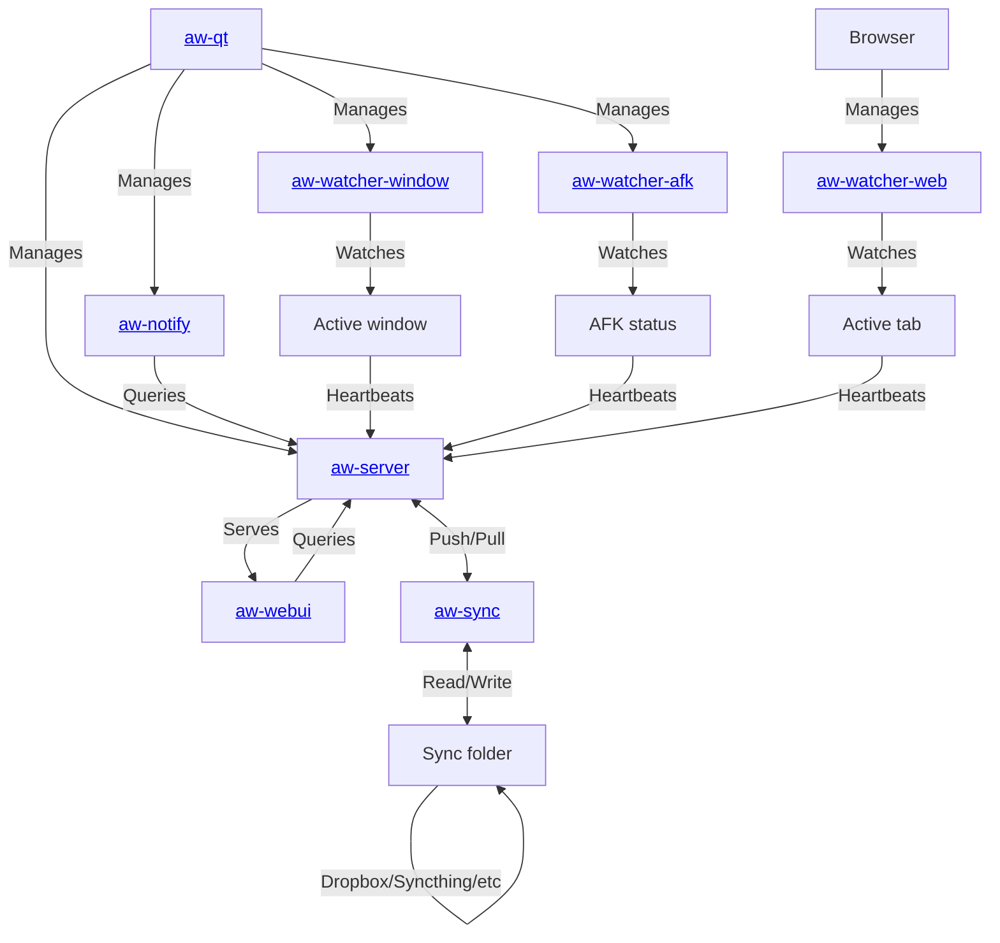

<p align="center">
  <b>Records what you do</b> so that you can <i>know how you've spent your time</i>.
  <br>
  All in a secure way where <i>you control the data</i>.
</p>

<p align="center">
  <a href="https://twitter.com/ActivityWatchIt">
    
  </a>
  <a href="https://github.com/ActivityWatch/activitywatch">
    
  </a>

  <br>

  <b>
    <a href="https://activitywatch.net/">Website</a>
    — <a href="https://forum.activitywatch.net/">Forum</a>
    — <a href="https://docs.activitywatch.net">Documentation</a>
    — <a href="https://github.com/ActivityWatch/activitywatch/releases">Releases</a>
  </b>

  <br>

  <b>
    <a href="https://activitywatch.net/contributors/">Contributor stats</a>
    — <a href="https://activitywatch.net/ci/">CI overview</a>
  </b>
</p>

<p align="center">
  <a href="https://github.com/ActivityWatch/activitywatch/actions?query=branch%3Amaster">
    
  </a>
  <a href="https://ci.appveyor.com/project/ErikBjare/activitywatch">
    
  </a>
  <a href="https://docs.activitywatch.net">
    
  </a>

  <br>

  <a href="https://github.com/ActivityWatch/activitywatch/releases">
    
  </a>
  <a href="https://github.com/ActivityWatch/activitywatch/releases">
    
  </a>
  <a href="https://discord.gg/vDskV9q">
    
  </a>

  <br>

  <a href="https://activitywatch.net/donate/">
    
  </a>
  <a href="https://doi.org/10.5281/zenodo.4957165">
    
  </a>
</p>

<!--
# TODO: Best practices badge that we should work towards, see issue #42.
[](https://bestpractices.coreinfrastructure.org/projects/873)
[](https://app.fossa.io/projects/git%2Bhttps%3A%2F%2Fgithub.com%2FActivityWatch%2Factivitywatch?ref=badge_shield)
-->


*Do you want to receive email updates on major announcements?*<br>
***[Signup for the newsletter](http://eepurl.com/cTU6QX)!***

<details>
 <summary>Table of Contents</summary>

 * [About](#about)
    * [Screenshots](#screenshots)
    * [Is this yet another time tracker?](#is-this-yet-another-time-tracker)
       * [Feature comparison](#feature-comparison)
    * [Installation &amp; Usage](#installation--usage)
 * [About this repository](#about-this-repository)
    * [Server](#server)
    * [Watchers](#watchers)
    * [Libraries](#libraries)
 * [Contributing](#contributing)
</details>

## About

The goal of ActivityWatch is simple: *Enable the collection of as much valuable lifedata as possible without compromising user privacy.*

We've worked towards this goal by creating an application for safe storage of the data on the user's local machine and as well as a set of watchers which record data such as:

 - Currently active application and the title of its window
 - Currently active browser tab and its title and URL
 - Keyboard and mouse activity, to detect if you are AFK ("away from keyboard") or not

It is up to you as user to collect as much as you want, or as little as you want (and we hope some of you will help write watchers so we can collect more).

### Screenshots

<span></span>
<span></span>

You can find more (and newer) screenshots on [the website](https://activitywatch.net/screenshots/).


## Installation & Usage

Downloads are available on the [releases page](https://github.com/ActivityWatch/activitywatch/releases).

For instructions on how to get started, please see the [guide in the documentation](https://docs.activitywatch.net/en/latest/getting-started.html).

Interested in building from source? [There's a guide for that too](https://docs.activitywatch.net/en/latest/installing-from-source.html).

## Is this yet another time tracker?

Yes, but we found that most time trackers lack one or more important features.

**Common dealbreakers:**

 - Not open source
 - The user does not own the data (common with non-open source options)
 - Lack of synchronization (and when available: it's centralized and the sync server knows everything)
 - Difficult to setup/use (most open source options tend to target programmers)
 - Low data resolution (low level of detail, does not store raw data, long intervals between entries)
 - Hard or impossible to extend (collecting more data is not as simple as it could be)

**To sum it up:**

 - Closed source solutions suffer from privacy issues and limited features.
 - Open source solutions aren't developed with end-users in mind and are usually not written to be easily extended (they lack a proper API). They also lack synchronization.

We have a plan to address all of these and we're well on our way. See the table below for our progress.


### Feature comparison

##### Basics

|               | User owns data     | GUI                | Sync                       | Open Source        |
| ------------- |:------------------:|:------------------:|:--------------------------:|:------------------:|
| ActivityWatch | :white_check_mark: | :white_check_mark: | [WIP][sync], decentralized | :white_check_mark: |
| [Selfspy]       | :white_check_mark: | :x:                | :x:                        | :white_check_mark: |
| [ulogme]        | :white_check_mark: | :white_check_mark: | :x:                        | :white_check_mark: |
| [RescueTime]    | :x:                | :white_check_mark: | Centralized                | :x:                |
| [WakaTime]      | :x:                | :white_check_mark: | Centralized                | Clients            |

[sync]: https://github.com/ActivityWatch/activitywatch/issues/35
[Selfspy]: https://github.com/selfspy/selfspy
[ulogme]: https://github.com/karpathy/ulogme
[RescueTime]: https://www.rescuetime.com/
[WakaTime]: https://wakatime.com/

##### Platforms
<!-- TODO: Replace Platform names with icons  -->

|               | Windows            | macOS              | Linux              | Android            | iOS                 |
| ------------- |:------------------:|:------------------:|:------------------:|:------------------:|:-------------------:|
| ActivityWatch | :white_check_mark: | :white_check_mark: | :white_check_mark: | :white_check_mark: |:x:                  |
| Selfspy       | :white_check_mark: | :white_check_mark: | :white_check_mark: | :x:                |:x:                  |
| ulogme        | :x:                | :white_check_mark: | :white_check_mark: | :x:                |:x:                  |
| RescueTime    | :white_check_mark: | :white_check_mark: | :white_check_mark: | :white_check_mark: |Limited functionality|

##### Tracking

|               | App & Window Title | AFK                | Browser Extensions | Editor Plugins     | Extensible            |
| ------------- |:------------------:|:------------------:|:------------------:|:------------------:|:---------------------:|
| ActivityWatch | :white_check_mark: | :white_check_mark: | :white_check_mark: | :white_check_mark: | :white_check_mark:    |
| Selfspy       | :white_check_mark: | :white_check_mark: | :x:                | :x:                | :x:                   |
| ulogme        | :white_check_mark: | :white_check_mark: | :x:                | :x:                | :x:                   |
| RescueTime    | :white_check_mark: | :white_check_mark: | :white_check_mark: | :x:                | :x:                   |
| WakaTime      | :x:                | :white_check_mark: | :white_check_mark: | :white_check_mark: | Only for text editors |

For a complete list of the things ActivityWatch can track, [see the page on *watchers* in the documentation](https://docs.activitywatch.net/en/latest/watchers.html).


## Architecture



## About this repository

This repo is a bundle of the core components and official modules of ActivityWatch (managed with `git submodule`). Its primary use is as a meta-package providing all the components in one repo; enabling easier packaging and installation. It is also where releases of the full suite are published (see [releases](https://github.com/ActivityWatch/activitywatch/releases)).

### Server

`aw-server` is the official implementation of the core service which the other ActivityWatch services interact with. It provides a REST API to a datastore and query engine. It also serves the web interface developed in the `aw-webui` project (which provides the frontend part of the webapp).

The REST API includes:

 - Access to a datastore suitable for timeseries/timeperiod-data
 - A query engine and language for such data

The webapp includes:

 - Data visualization & browser
 - Query explorer
 - Export functionality 

### Watchers

ActivityWatch comes pre-installed with two watchers:

 - `aw-watcher-afk` tracks the user active/inactive state from keyboard and mouse input
 - `aw-watcher-window` tracks the currently active application and its window title.

There are lots of other watchers for ActivityWatch which can track more types of activity. Like `aw-watcher-web` which tracks time spent on websites, multiple editor watchers which track spent time coding, and many more! A full list of watchers can be found in [the documentation](https://docs.activitywatch.net/en/latest/watchers.html).

### Libraries

 - `aw-core` - core library, provides no runnable modules
 - `aw-client` - client library, useful when writing watchers

### Folder structure

<span></span>

## Contributing

Want to help? Great! Check out the [CONTRIBUTING.md file](./CONTRIBUTING.md)!

## Questions and support

Have a question, suggestion, problem, or just want to say hi? Post on [the forum](https://forum.activitywatch.net/)!

# Samay Core Engine - ActivityWatch Data Synchronization

## 🎯 **Project Overview**

**Samay** is a robust data synchronization system that extracts activity data from ActivityWatch and sends it to external servers. The system is designed to be resilient, efficient, and maintainable.

## 🏗️ **Architecture Overview**

```
┌─────────────────┐    ┌──────────────────┐    ┌─────────────────┐
│  ActivityWatch  │    │   Samay Sync     │    │   Backend       │
│   Database      │───▶│    Engine        │───▶│   Server        │
│  (SQLite)       │    │                  │                  
└─────────────────┘    └──────────────────┘    └─────────────────┘
```

### **Core Components**

1. **Database Connection Module** - Connects to ActivityWatch SQLite database
2. **Sync State Manager** ✅ - Tracks synchronization progress and prevents duplicates
3. **Data Processor** - Transforms events into required JSON format
4. **HTTP Client** - Sends data to backend servers with authentication
5. **Scheduler** - Manages automated sync intervals
6. **Error Handler** - Manages failures and retries

## 🚀 **Getting Started**

### **Prerequisites**
- Python 3.8+
- ActivityWatch running and collecting data
- Access to ActivityWatch SQLite database

### **Installation**
```bash
# Clone the repository
git clone <repository-url>
cd samay-core-engine

# Install dependencies
pip install -r requirements.txt
```

### **Quick Test**
```bash
# Test database connection
python3 test_database.py

# Test sync state management
python3 test_sync_manager.py
```

## 📁 **Project Structure**

```
samay-core-engine/
├── samay_sync/                 # Main package
│   ├── __init__.py            # Package initialization
│   ├── database.py            # Database connection module
│   ├── sync_manager.py        # Sync state management ✅
│   ├── data_processor.py      # Data transformation (TODO)
│   ├── http_client.py         # HTTP communication (TODO)
│   └── scheduler.py           # Sync scheduling (TODO)
├── scripts/                    # Utility scripts
│   ├── run.sh                 # Start ActivityWatch dev environment
│   └── stop.sh                # Stop ActivityWatch dev environment
├── test_database.py           # Database connection test
├── test_sync_manager.py       # Sync state manager test ✅
├── requirements.txt            # Python dependencies
└── README.md                  # This file
```

## 🔧 **Database Module Documentation**

### **ActivityWatchDB Class**

The core database connection class that handles all interactions with the ActivityWatch SQLite database.

#### **Key Features**
- **Automatic path detection** for macOS ActivityWatch database
- **Context manager support** for safe connection handling
- **Batch processing** for memory-efficient data extraction
- **Flexible filtering** by bucket, time range, and other criteria

#### **Usage Examples**

```python
from samay_sync.database import ActivityWatchDB

# Basic usage with context manager
with ActivityWatchDB() as db:
    # Get database information
    info = db.get_database_info()
    print(f"Total events: {info['total_events']}")
    
    # Get all buckets
    buckets = db.get_buckets()
    for bucket in buckets:
        print(f"Bucket: {bucket['id']}")
    
    # Get events with filtering
    events = db.get_events(
        bucket_id="aw-watcher-window_hostname",
        limit=100,
        start_time=datetime.now() - timedelta(days=1)
    )
    
    # Process events in batches (memory efficient)
    for batch in db.get_events_generator(batch_size=1000):
        process_batch(batch)
```

#### **Database Schema**

The system works with ActivityWatch's actual database structure:

**Tables:**
- `bucketmodel` - Data source buckets (window watcher, AFK watcher, etc.)
- `eventmodel` - Individual activity events

**Key Fields:**
- `eventmodel.id` - Unique event identifier
- `eventmodel.bucket_id` - Reference to bucket
- `eventmodel.timestamp` - When the event occurred
- `eventmodel.duration` - How long the event lasted
- `eventmodel.datastr` - JSON string containing event data

## 🔄 **Sync State Manager** ✅

### **What It Does**
- **Prevents duplicates** by tracking last synced event IDs
- **Tracks sync progress** for each bucket independently
- **Handles failures gracefully** (success, partial, failed, never)
- **Persists state** across application restarts
- **Provides monitoring** with comprehensive sync summaries

### **Key Features**
- Zero data loss architecture
- Smart event ID tracking
- Automatic state file backups
- Error recovery mechanisms
- Real-time sync status monitoring

### **Usage Example**
```python
from samay_sync.sync_manager import SyncStateManager

# Initialize sync state manager
sync_manager = SyncStateManager()

# Get unsynced events for a bucket
unsynced_events = sync_manager.get_events_since_last_sync(
    bucket_id="bucket_id",
    all_events=all_bucket_events
)

# Update sync state after successful transmission
sync_manager.update_sync_success(
    bucket_id="bucket_id",
    last_event_timestamp="2025-08-22T12:00:00Z",
    last_event_id=100,
    events_synced=50
)

# Get sync summary
summary = sync_manager.get_sync_summary()
```

## 🔄 **Workflow Documentation**

### **Data Flow Process**

```
1. Database Connection
   ├── Validate database path
   ├── Establish SQLite connection
   └── Verify table structure

2. Event Extraction
   ├── Query events with filtering
   ├── Parse JSON data from datastr
   ├── Join with bucket information
   └── Return structured event data

3. Sync State Management ✅
   ├── Track last sync timestamp
   ├── Identify new events since last sync
   ├── Prevent duplicate data transmission
   └── Handle sync failures gracefully

4. Data Processing (TODO)
   ├── Transform events to required format
   ├── Add user authentication headers
   ├── Validate data integrity
   └── Prepare for transmission

5. HTTP Transmission (TODO)
   ├── Send data to backend server
   ├── Handle authentication
   ├── Respect rate limits
   └── Manage retries on failure

6. Sync Completion (TODO)
   ├── Update sync state
   ├── Log successful transmission
   ├── Handle any errors
   └── Schedule next sync
```

### **Error Handling Strategy**

```
Error Type          | Action                    | Retry Strategy
────────────────────|───────────────────────────|─────────────────
Database Connection | Log error, exit gracefully| Manual restart
Invalid Data        | Skip event, log warning   | Continue with next
Network Failure     | Queue for retry           | Exponential backoff
Server Error        | Log error, retry later    | Scheduled retry
Authentication      | Log error, stop sync      | Manual intervention
```

## 📊 **Configuration**

### **Database Paths**
- **macOS**: `~/Library/Application Support/activitywatch/aw-server/peewee-sqlite.v2.db`
- **Linux**: `~/.local/share/activitywatch/aw-server/peewee-sqlite.v2.db`
- **Windows**: `%APPDATA%\activitywatch\aw-server\peewee-sqlite.v2.db`

### **Environment Variables**
```bash
# Database path override
SAMAY_DB_PATH=/custom/path/to/database.db

# Log level
SAMAY_LOG_LEVEL=INFO

# Sync interval (seconds)
SAMAY_SYNC_INTERVAL=300
```

## 🧪 **Testing**

### **Running Tests**
```bash
# Test database connection
python3 test_database.py

# Test sync state management
python3 test_sync_manager.py

# Run all tests (when implemented)
python -m pytest tests/
```

### **Test Coverage**
- ✅ Database connection and validation
- ✅ Event extraction and filtering
- ✅ Bucket information retrieval
- ✅ Batch processing functionality
- ✅ Sync state management ✅
- ❌ Data processing (TODO)
- ❌ HTTP client (TODO)
- ❌ Error handling (TODO)

## 🚧 **Development Status**

### **Completed Components**
- ✅ Database connection module
- ✅ Event extraction logic
- ✅ Database schema mapping
- ✅ Sync state manager ✅
- ✅ Test scripts

### **In Progress**
- 🔄 Configuration system planning

### **Next Priorities**
1. **Configuration System** - Manage settings and environment variables
2. **Error Handling Framework** - Robust failure management
3. **Data Processing Pipeline** - Transform events to required format

### **Waiting For**
- Backend team specifications:
  - JSON data structure requirements
  - API endpoint details
  - Authentication format
  - Rate limiting constraints

## 🤝 **Contributing**

### **Development Workflow**
1. **Fork** the repository
2. **Create** a feature branch
3. **Implement** your changes
4. **Test** thoroughly
5. **Document** any new functionality
6. **Submit** a pull request

### **Code Standards**
- **Python**: PEP 8 compliance
- **Documentation**: Comprehensive docstrings
- **Testing**: Unit tests for all new functionality
- **Logging**: Appropriate log levels and messages

## 📝 **Changelog**

### **v0.1.0** - Initial Foundation
- ✅ Database connection module
- ✅ Event extraction functionality
- ✅ Basic testing framework
- ✅ Project documentation

### **v0.2.0** - Sync State Management ✅
- ✅ Sync state manager for duplicate prevention
- ✅ Progress tracking and failure handling
- ✅ State persistence across restarts
- ✅ Comprehensive sync monitoring

## 🔗 **Related Projects**

- **ActivityWatch**: [https://activitywatch.net/](https://activitywatch.net/)
- **ActivityWatch GitHub**: [https://github.com/ActivityWatch/activitywatch](https://github.com/ActivityWatch/activitywatch)

## 📞 **Support**

For questions, issues, or contributions:
- **Issues**: Create a GitHub issue
- **Discussions**: Use GitHub discussions
- **Documentation**: Check this README and inline code documentation

---

**Built with ❤️ by the Samay Team**

